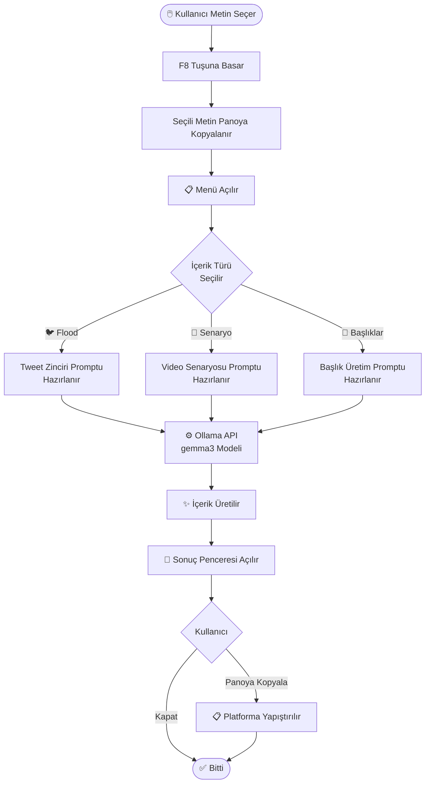

# ✨ Sosyal Medya & İçerik Üretim Asistanı

<div align="center">

### Sıkıcı bir metni seç → F8'e bas → Viral içeriğe dönüştür

[](https://www.python.org/downloads/)
[](https://docs.ollama.com/quickstart)
[](https://docs.ollama.com/windows)

**Kurulum otomatik · Framework yok · Tek `.pyw` dosyası**

</div>

---

## 🎯 Bu Proje Nedir?

Haber sitelerinde okuduğunuz uzun ve sıkıcı bir makale ya da aklınıza gelen ham bir fikir, sosyal medyada paylaşılabilir hale gelmesi için saatler alabilir. Doğru format, dikkat çekici bir açılış, platform kuralları... hepsi ayrı bir iş.

**Sosyal Medya & İçerik Üretim Asistanı**, bilgisayarınızda arka planda çalışır. Herhangi bir metni seçip F8'e basmanız yeterlidir — yapay zeka saniyeler içinde o metni istediğiniz içerik formatına dönüştürür.

---

## 🤔 Neden Bu Aracı Kullanmalısınız?

Sosyal medya içeriği üretmek zaman alır ve platform kurallarını bilmek gerektirir. Bu araç ise:

- **Anında çalışır** — tarayıcı, belge, not defteri; herhangi bir uygulamada metni seçip F8'e basın
- **Platform uyumlu üretir** — her seçenek o platforma özel kurallara göre (karakter sınırı, hook, CTA) içerik yazar
- **Clickbait değil** — başlıklar ilgi çekici ama yanıltıcı değil; içerikle uyumlu
- **Yerel çalışır** — verileriniz dışarı çıkmaz, internet bağlantısı gerekmez

---

## 👥 Hedef Kitle

| Kullanıcı | Kullanım Amacı |
|-----------|----------------|
| İçerik üreticileri | Haberleri ve fikirleri hızla sosyal medya formatına çevirmek |
| Öğrenciler | Ders notlarından veya makalelerden özet içerik üretmek |
| Yazılım geliştiriciler | Teknik konuları geniş kitlelere ulaşacak şekilde yazmak |

---

## 🗂 Menü Seçenekleri

Herhangi bir metni seçip **F8**'e bastığınızda şu seçenekler çıkar:

| Seçenek | Ne Yapar? |
|---------|-----------|
| 🐦 X (Twitter) Flood Zincirine Çevir | Hook + gelişim + CTA yapısında, 280 karakter sınırına uygun numaralı tweet zinciri üretir |
| 📸 YouTube Shorts / TikTok Video Senaryosu Yaz | 60 saniyelik kısa video senaryosu yazar: 0-3sn hook, 3-45sn gelişim, 45-60sn kapanış |
| 🧲 Tıklanma Oranı Yüksek Başlıklar Üret | Haber, Twitter ve YouTube/TikTok için 3'er adet başlık + neden tıklanır gerekçesi |

Tüm çıktılar ayrı bir pencerede açılır. **"Panoya Kopyala"** butonuyla istediğiniz platforma yapıştırabilirsiniz.

---

## 🚀 Nasıl Çalışır?

**Adım 1 — Bir kez kur**

`BASLAT.bat` dosyasını çalıştır. Gerekli ortamı otomatik kurar.

**Adım 2 — Metin seç**

Tarayıcıda, belgede veya herhangi bir uygulamada bir metin ya da fikri seçin.

**Adım 3 — F8'e bas**

Menü açılır. İstediğiniz içerik türünü seçin.

**Adım 4 — Kopyala & Paylaş**

Üretilen içerik ayrı pencerede görünür. Panoya kopyalayıp platforma yapıştırın.

---

## 🔄 Uygulama Akışı



---

## 🛠 Teknik Detaylar

| Teknoloji | Kullanım Amacı |
|-----------|----------------|
| Python 3.13 | Ana uygulama dili |
| Tkinter | Menü ve sonuç penceresi arayüzü |
| pynput | F8 kısayol dinleyici |
| pyperclip / pyautogui | Metin seçme ve pano işlemleri |
| Ollama API | Yerel yapay zeka modeli (gemma3) |

Framework kullanılmamıştır. Tek bir `.pyw` dosyasıdır, arka planda sessizce çalışır.

---

## 📁 Proje Yapısı

```
icerik-asistani/
│
├── main.pyw          # Uygulamanın tamamı
├── BASLAT.bat        # Tek tıkla başlatıcı
├── kurulum.bat       # Ortam kurulum scripti
└── requirements.txt  # Python bağımlılıkları
```

---

## 💻 Kullanım

Kurulum otomatiktir:

```bash
# Repoyu klonla
git clone https://github.com/Metovskii/icerik-asistani

# BASLAT.bat dosyasını çalıştır — gerisini otomatik halleder
```

> `BASLAT.bat` gerekirse `kurulum.bat`'ı otomatik çağırır: Python kontrolü → `.venv` oluşturma → pip güncelleme → paket kurulumu.

Ollama API varsayılan adresi: `http://localhost:11434`

---

## 🎓 Yapay Zeka Kullanımı

Bu projede yapay zekadan kod yazımında destek alınmıştır. Ancak:

- Projenin ne olacağına ve hangi mesleğe hitap edeceğine **Mete Demirdaş** karar vermiştir
- Hangi özelliklerin ekleneceğini **Mete Demirdaş** belirlemiştir
- README içeriği ve proje sunumu **Mete Demirdaş** tarafından düzenlenmiştir
